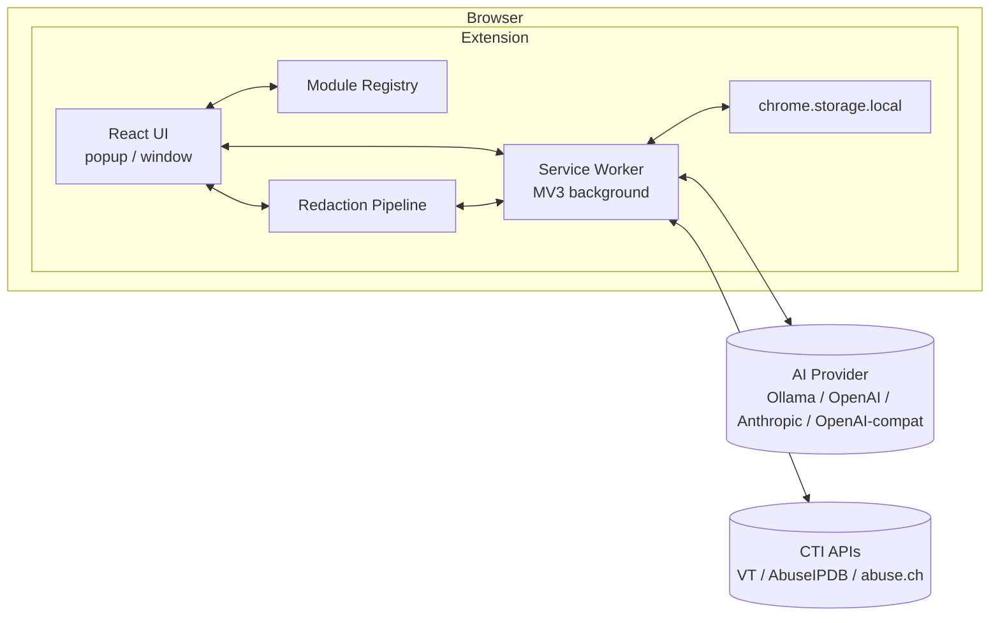

# Technical Design: Mimir

| Field | Value |
|---|---|
| Companion Doc | `PRD.md` v3.4 |
| Document Version | 2.4 |
| Status | Approved scope for MVP |
| Scope | MVP (v1.0) with forward-looking notes for v1.1+ |

### Changelog
- **2.4** — `TextTransformPanel` interface (§10.1) gains four optional fields populated by its first two callers: `group` and `inverse` on each transform (Encoding uses `group` for optgroups; Defang uses `inverse` so its bidirectional swap also flips to the paired transform), and controlled-input props `value`/`onValueChange` and `transformId`/`onTransformIdChange` (Encoding uses these to persist input across popup reopens). All four are optional and backwards-compatible with the v2.3 documented use case.
- **2.3** — CTI cache and history collapsed into a single unified store (TTL = staleness, not deletion; LRU at 100). New §8 documents Log Analysis history (last 10 entries, FIFO). New §10.1 specifies the shared `TextTransformPanel` component for input-transform-output modules. Sections renumbered.
- **2.2** — Right-click invocation always opens the popup (predictability over situational routing); CTI cache and history clarified as separate stores with combined "Clear CTI data" action; sidebar render order specified (category sequence, then alphabetical by label).
- **2.1** — `MimirModule` interface gains optional `contextMenu` field; new §4.3 describes context-menu wiring and per-action user toggles; AI provider default behaviour clarified (empty field, placeholder text only); storage layout adds `settings.contextMenu.*`.
- **2.0** — Aligned with PRD v3.0: removed signing/sandboxing/permissions infra, removed enforced rate-limiting, removed performance budgets and security-considerations sections, removed prompt-merge layer (AGENTS.md is for AI dev tooling, not runtime), removed dogfood QA, removed sync storage, removed paid-store-driven decisions. Added Defang module, abuse.ch API mode, OpenAI/Anthropic/OpenAI-compatible AI providers, two-surface UI (popup + window), opt-in redaction.
- **1.0** — Initial design.

---

## 1. Overview

Mimir is a Manifest V3 browser extension. React/TypeScript frontend, build-time module registry, three-stage opt-in redaction pipeline, and a service-worker layer for outbound HTTP (CTI, AI). All data is local. No server-side component is owned or operated by the project.

This document is the **how**. Product rationale and requirements live in `PRD.md`.

> **Note on `AGENTS.md`.** A file named `AGENTS.md` exists at the repo root, but it is **not** a runtime artifact. It is a developer-facing prompt file used when working on Mimir with AI coding assistants (Claude, etc.) to enforce architectural conventions, file layout, and best practices during development. It is not loaded by the extension at runtime and is not part of any prompt-resolution chain.

## 2. Architecture



The UI never talks to external networks directly — all outbound HTTP flows through the service worker. Stage 1 of the redaction pipeline runs in the UI context (synchronous regex work); Stage 2 (optional AI) goes through the service worker.

## 3. Browser Platform

**Chromium-based browsers (Chrome, Edge, Brave, Arc) and Firefox**, all on MV3.

A webpack config variant produces two builds:
- `pnpm build:chromium` → `dist/chromium/`
- `pnpm build:firefox` → `dist/firefox/`

A thin `browser-compat` module abstracts API differences (`storage` event semantics, `scripting` namespace, background-context model). Most of the codebase is unaware of which browser it's running in.

**MV3 service-worker lifecycle.** Workers terminate after ~30s idle. AI calls — especially to local models running large prompts — frequently exceed this. Mitigation: during in-flight AI/CTI requests, the service worker holds a `chrome.alarms` keepalive. Long calls that exceed 4 minutes are aborted with a clear timeout to the user.

**Manifest permissions.** Minimum viable set:
- `storage` — settings, history, API keys.
- `contextMenus` — right-click integration.
- `activeTab` — read selected text only when the user invokes Mimir.
- `host_permissions`: requested at runtime via `permissions.request()` for the user-configured AI endpoint and CTI hosts. Avoids declaring `<all_urls>` upfront.

## 4. Module System

### 4.1 Module Interface

Kept simple. No permissions registry, no signing, no sandboxing.

```typescript
interface MimirModule {
  id: string;                    // stable, kebab-case, globally unique
  category: ModuleCategory;      // 'encoding' | 'cti' | 'analysis' | 'utilities' | 'payloads'
  label: string;                 // sidebar display name
  icon?: React.FC;
  component: React.FC;           // the module's UI

  // Optional: declare a right-click context-menu action for selected text.
  // Modules that operate on text-selections-from-pages opt in here.
  // Users can individually disable any registered action in settings.
  contextMenu?: {
    title: string;               // e.g. "Decode with Mimir"
    onInvoke: (selection: string) => void;  // typically: open popup, route to this module, prefill
  };
}

type ModuleCategory =
  | 'encoding'
  | 'cti'
  | 'analysis'
  | 'utilities'
  | 'payloads';
```

That's the whole interface. Modules import shared services (`storage`, `aiClient`, `redact`) directly from internal paths — no capability wrapper, no scoped facades. The user is the trust boundary; if they install a hostile module in their own fork, that's on them.

### 4.2 Registry Loading

Built-in modules are discovered at build time by a webpack loader that scans `src/modules/*/index.ts` for default exports matching `MimirModule`. The registry is a plain object keyed by `id`.

Sidebar render order is computed deterministically: **group by `category`** in a fixed category sequence (`encoding` → `utilities` → `cti` → `analysis` → `payloads`), then **alphabetical by `label`** within each group. No per-module `order` field — order is a function of category and label, nothing else.

No dynamic code loading at runtime — MV3 CSP forbids it anyway, and we have no reason to want it. Custom modules are added to source and rebuilt.

### 4.3 Context Menu Wiring

At extension startup the service worker walks the registry, collects every module that declares a `contextMenu`, and registers a `chrome.contextMenus` entry for each — **subject to the user's per-action toggle in settings** (default: enabled).

When the user toggles an action in settings, the service worker incrementally re-registers the affected entry without rebuilding the full menu. When the user invokes a context-menu entry, the worker **always opens the popup** (even if the standalone window is also open), switches to the target module, and prefills the input via the module's `onInvoke` handler. Popup is the consistent target — chosen for predictability over situational cleverness.

A module that does not declare `contextMenu` simply does not appear in the right-click menu at all. The right-click surface is therefore opt-in at two levels: the module author opts in by declaring it, and the user opts in (or opts out) per action.

### 4.4 Adding a Custom Module

1. Create `src/modules/my-tool/`.
2. Implement and `export default` a `MimirModule`.
3. `pnpm build:chromium` (or `:firefox`).
4. Load the unpacked extension from `dist/`.

That's it. `docs/CONTRIBUTING-MODULES.md` walks through it with a worked example.

## 5. Redaction Pipeline

User-invoked, opt-in. Lives in its own module (`src/modules/redaction/`). Other modules — including Log Analysis — do **not** call it automatically.

### 5.1 Data Flow

```
User pastes text into Redaction module
   │
   ▼
[Stage 1: Deterministic detectors]   ──►  tokenize matches, replace with placeholders
   │                                       produce: (redactedText, detections[])
   ▼
[Stage 2: AI enrichment — OPTIONAL]  ──►  off by default; if enabled, AI proposes ADDITIONAL flags
   │                                       invariant: Stage 1 placeholders are never un-replaced
   ▼
[Stage 3: User review UI]            ──►  diff view; user accepts/rejects each; can add manual
   │                                       produce: (finalRedactedText)
   ▼
[Output: clipboard, or user paste into another module]
```

Stage 2 is **off by default**. The user toggles it on per-session (or persistently in settings) if they want AI enrichment.

The redaction module's output is shown in the UI and copyable. It is not piped to any other module automatically — the user moves it manually if they want to. This is consistent with the design principle that the user owns the workflow.

### 5.2 Stage 1 — Deterministic Detectors

Each detector is a pure function `(text) => Detection[]`. Detectors are individually toggleable in settings.

| Detector | Approach |
|---|---|
| IPv4 | Standard regex; optional RFC1918 carve-out |
| IPv6 | Full and compressed forms |
| Email | RFC-5322-subset regex |
| FQDN | Domain regex with TLD sanity check |
| AWS access key | `^AKIA[0-9A-Z]{16}$` and secret-key shape heuristic |
| GitHub token | `ghp_`, `gho_`, `ghu_`, `ghs_`, `ghr_` prefixes |
| JWT | `xxx.yyy.zzz` with base64url segments |
| Bearer token | `Authorization:\s*Bearer\s+<opaque>` contextual match |
| Private key blocks | `-----BEGIN * PRIVATE KEY-----` |
| MAC address | Six-octet standard format |
| User paths | `/Users/<n>/`, `/home/<n>/`, `C:\Users\<n>\` |
| UUID / high-entropy | Generic UUID v4 + entropy heuristic |

Each `Detection` carries `{ type, start, end, original, placeholder }`. Placeholders are stable within a session — the same `original` always gets the same placeholder (e.g., `IP_1`, `IP_2`) — so downstream consumers can reason about relationships.

### 5.3 Stage 2 — AI Enrichment (Optional)

When enabled, the configured AI provider is given the Stage-1 output and a prompt asking for additional sensitive content Stage 1 missed (contextual PII, internal codenames, project names). The prompt explicitly forbids unflagging Stage 1 hits. The AI returns a JSON list; the pipeline validates and merges.

If the AI is unreachable or returns malformed output, Stage 2 is skipped silently and the user proceeds with Stage 1 results only.

### 5.4 Stage 3 — User Review UI

Split-pane diff. Left: original with highlighted detections. Right: redacted preview. Per-detection accept/reject controls. A free-text "add manual redaction" box. An "Apply" button finalizes the redacted text into the output panel.

### 5.5 Benchmark Corpus

`tests/redaction-corpus/` holds **~100 labeled examples** for v1, sourced from synthesized data and public CTF/IR writeups. CI runs the detectors against the corpus on every PR and reports precision/recall per detector. Regressions are visible but not auto-blocking — judgment call per PR.

The corpus is published openly in the repo.

## 6. CTI Integration

Service worker exposes `ctiLookup(indicator, sources[])` that fans out to configured providers in parallel.

| Provider | Auth | Notes |
|---|---|---|
| VirusTotal v3 | API key | — |
| AbuseIPDB v2 | API key | — |
| hunting.abuse.ch | None **or** API key | User picks per-request mode in settings |

**No client-side rate limiting.** If the user hits a provider's limit, they see the provider's 429 response and deal with it. Mimir does not pre-emptively throttle.

**Unified history store** (`cti.history.*`). One store, one row per lookup. Each entry holds:

- `timestamp`, `query`, `provider`, `verdict` (audit metadata)
- `response` — the full provider response body
- `staleAfter` — timestamp = `timestamp + ttl`

**Cap: 100 entries**, LRU eviction (the entry with the oldest `timestamp` is dropped when a new lookup would exceed the cap). **TTL: 72h default, configurable.**

TTL determines **freshness**, not lifetime. When the user clicks an entry whose `staleAfter` is in the past, the lookup re-fires against the provider and the entry is updated in place. When the entry is fresh, the stored response renders instantly with no network call. A new lookup of an indicator already in the store updates the existing entry (same row, refreshed `timestamp`/`response`) rather than creating a duplicate.

The store therefore serves as both response cache and audit log — one mental model, one persistence layer, one clear action to wipe.

**"Clear CTI history"** wipes the entire store in one operation.

## 7. AI Integration

A single `AiClient` class with one adapter per provider type:

| Adapter | Endpoint shape |
|---|---|
| Ollama | `POST /api/generate` with `{model, prompt, stream: false}` |
| OpenAI-compatible | `POST /v1/chat/completions` with standard message array (covers OpenAI itself, LocalAI, llama.cpp server, vLLM, LM Studio, plus any user-supplied URL) |
| Anthropic | `POST /v1/messages` with `x-api-key` and `anthropic-version` headers |

The user configures one or more providers in settings. Each AI-using module can either pick a specific provider or fall back to a global default.

**Default state on first install.** No provider is preconfigured. The endpoint URL field is empty, with `http://localhost:11434` shown as placeholder text (the Ollama default) so a user who has Ollama running can copy it in one click. AI-using modules show a "configure a provider in settings" empty state until at least one provider exists.

**Prompt resolution.** Each AI-using feature has a default system prompt baked into source. The user can override it in settings — overrides are stored in `chrome.storage.local` under `prompts.<feature-id>` and take precedence at call time. This is a simple two-layer lookup: user override → built-in default. There is no `AGENTS.md` involvement (see §1).

**MV3 keepalive** is handled by the service worker wrapping the fetch in an alarms-based heartbeat (see §3).

## 8. Log Analysis History

The Log Analysis module keeps a local history of the **last 10 analyses**. Each entry stores:

- `timestamp`
- `input` — the raw log content the user submitted
- `response` — the AI's Markdown response
- `provider` — which AI provider was used (so the user can see e.g. "this was Ollama llama3 vs. Anthropic")

Eviction is straightforward FIFO at the cap (oldest goes when an 11th would be added). No TTL — entries live until they're pushed out by newer ones or the user clears the history.

A history pane in the module UI lists entries newest-first; clicking one re-renders the stored response in the main view. There is no re-submit-on-click — the stored response is what was returned at the time, and the user can re-run by pasting the input back into the active panel if they want a fresh analysis.

**"Clear log analysis history"** wipes the store in one operation.

The 10-entry cap is intentionally small. If users start asking for more, it gets revisited; in the meantime, "the last 10" matches the way analysts actually use this kind of history (recent context, not long-term archive).

## 9. Storage Layer

Single `StorageManager` facade over `chrome.storage.local`. Keys are namespaced:

```
settings.*                — user preferences, AI provider config, detector toggles
settings.contextMenu.*    — per-action enable/disable toggles, keyed by module id
apikeys.*                 — provider API keys (plaintext; documented in PRD)
cti.history.*             — unified CTI lookup store (audit log + response cache, 100 max, LRU)
analysis.history.*        — Log Analysis history (last 10 runs)
prompts.*                 — user-customized system prompts
```

No `chrome.storage.sync`. History stays on the device.

Storage events are bridged into a React context so UI updates react to writes from the service worker.

## 10. UI Architecture

**Two surfaces with full feature parity:** popup and standalone window. Same React tree mounted in two places. The standalone window is opened from a button in the popup; it carries the same module state and settings.

State management:
- **Zustand** for cross-module state (active module, settings, current redaction session).
- **React Query** for service-worker-mediated async (CTI lookups, AI calls).

Markdown rendering: `react-markdown` with `rehype-sanitize`, raw HTML stripped, image URLs restricted to `data:` (prevents an AI response from triggering image-load exfil — a sensible default that costs nothing, not an enforced safety control).

Mermaid rendering: client-side, in a try/catch that surfaces syntax errors as inline text rather than crashing.

### 10.1 Shared `TextTransformPanel`

Several modules — Encoding, Defang, eventually anything else built around an "input → transform → output" shape — share the same UI skeleton: a labeled input area, an action selector or button, an output area with copy-to-clipboard, optional bidirectional swap. Rather than duplicating that layout in each module, a single `<TextTransformPanel>` lives in `src/components/` and takes:

```typescript
interface TextTransform {
  id: string;
  label: string;
  fn: (input: string) => string | Promise<string>;
  // Optional: render the selector as <optgroup> chunks. Used by Encoding to
  // group Base64/Hex/URL/HTML/JWT operations.
  group?: string;
  // Optional: id of the paired transform. When `bidirectional` is true, the
  // swap button moves output -> input AND switches the active transform to
  // its inverse. Used by Defang (defang <-> refang).
  inverse?: string;
}

interface TextTransformPanelProps {
  inputLabel?: string;
  outputLabel?: string;
  transforms: ReadonlyArray<TextTransform>;
  defaultTransformId?: string;
  bidirectional?: boolean;       // shows a swap button if true
  // Optional controlled-input mode. When omitted, the panel manages input
  // and selected-transform state internally with `useState`. When provided,
  // the parent owns state — used by Encoding to persist the input across
  // popup reopens via chrome.storage.local.
  value?: string;
  onValueChange?: (value: string) => void;
  transformId?: string;
  onTransformIdChange?: (id: string) => void;
}
```

Modules that fit this shape become roughly: a `MimirModule` wrapper plus a few transform functions. Modules that don't fit (CTI with its provider results, Log Analysis with streaming markdown, Redaction with its multi-stage diff) keep their own bespoke UI — `TextTransformPanel` is a convenience for the simple cases, not a mandate.

## 11. Build & Distribution

Webpack config with per-target variants producing distinct manifests from a shared template:
- `pnpm build:chromium` → `dist/chromium/` + `mimir-chromium.zip`
- `pnpm build:firefox` → `dist/firefox/` + `mimir-firefox.zip`

CI: typecheck, unit tests, redaction corpus eval (reports precision/recall, doesn't auto-fail), web-ext lint for Firefox.

Distribution: GitHub releases with the unpacked builds and zips. Manual install is the primary path. Store submission is optional and not allowed to constrain product decisions.

## 12. Testing

**Unit.** Detector functions (property-based tests via `fast-check` for regex detectors), storage namespacing, prompt resolution, cache eviction.

**Integration.** Redaction pipeline end-to-end with a mock AI; CTI lookups with mocked provider responses; storage event bridging.

**Corpus eval.** Redaction precision/recall against `tests/redaction-corpus/` on every PR — informational, not a hard gate.

**Browser smoke.** Playwright loads the built extension, opens the popup, runs a decode and a mocked CTI lookup, verifies the redaction module renders Stages 1 and 3 correctly with Stage 2 disabled.

## 13. File Structure

```
.
├── src/
│   ├── background/              # MV3 service worker entry
│   │   ├── index.ts
│   │   ├── ai-client.ts
│   │   ├── cti-client.ts
│   │   └── keepalive.ts
│   ├── components/              # Shared UI primitives
│   │   ├── MarkdownView.tsx
│   │   ├── MermaidView.tsx
│   │   ├── RedactionDiff.tsx
│   │   └── TextTransformPanel.tsx  # Shared shell for input→transform→output modules
│   ├── modules/                 # Built-in modules — registry entries
│   │   ├── encoding/
│   │   ├── defang/
│   │   ├── cti/
│   │   ├── analysis/            # Log analysis
│   │   ├── redaction/
│   │   └── payloads/
│   ├── redaction/
│   │   ├── detectors/           # One file per detector
│   │   ├── pipeline.ts
│   │   └── types.ts
│   ├── registry/
│   │   ├── loader.ts            # webpack-time scanner
│   │   └── types.ts             # MimirModule interface
│   ├── storage/
│   │   └── manager.ts
│   ├── surfaces/                # popup, window entries
│   ├── browser-compat/          # Chromium/Firefox shim
│   ├── App.tsx
│   └── main.tsx
├── tests/
│   ├── unit/
│   ├── integration/
│   └── redaction-corpus/        # ~100 labeled examples + eval runner
├── docs/
│   ├── CONTRIBUTING-MODULES.md
│   └── ARCHITECTURE.md          # Links back here
├── manifest.chromium.json
├── manifest.firefox.json
├── AGENTS.md                    # Dev-time AI prompts (NOT a runtime artifact — see §1)
├── PRD.md
├── TECHNICAL_DESIGN.md          # This document
└── README.md
```