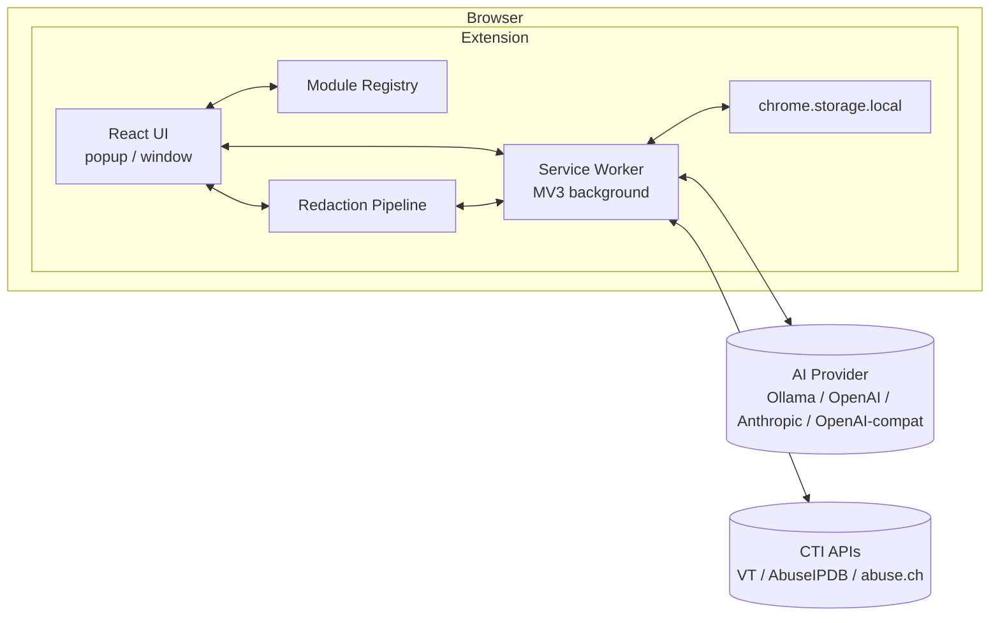

# Technical Design: Mimir

| Field | Value |
|---|---|
| Companion Doc | `PRD.md` v3.9 |
| Document Version | 2.10 |
| Status | Approved scope for MVP |
| Scope | MVP (v1.0) with forward-looking notes for v1.1+ |

### Changelog
- **2.10** — §4.3 background-mode invocation extended with auto-open on completion: when a background analysis lands and no Mimir surface is open, the runner writes a TTL'd `modules.analysis.openOnNextPopup` marker and calls `openPopup()`. The popup's dispatcher drains the marker on mount and via `storage.onChanged`, routes to Log Analysis, and surfaces the entry. Surface state is detected via `chrome.runtime.getContexts({ contextTypes: ['POPUP', 'TAB'] })`, feature-detected and conservative when unavailable. New SW helper `src/background/surface-state.ts`. §9 storage namespaces gain `modules.analysis.openOnNextPopup`.
- **2.9** — §7 standardized: a thin dispatcher (`src/background/ai-client.ts`) plus one `AiAdapter` implementation per provider in `src/background/ai-adapters/<provider>.ts`. The contract lives in `src/background/ai-adapters/types.ts`; the registry index is at `src/background/ai-adapters/index.ts`. Adding a new provider = create one file, add one entry to the registry. No user-visible behavior change.
- **2.8** — §7 adds AI You adapter: dual-auth (X-API-KEY / Bearer), SSE buffered internally with `tool_execution` events filtered out, hardcoded three-model list and `tools: [163]` (date) with `executeToolsDirectly: true`. `AiProviderConfig` gains optional `authMode` field used only by AI You. Endpoint URL is user-supplied (no shipped default), same shape as `openai-compatible`.
- **2.7** — §6 rewritten: CTI history shape changed to one entry per indicator with per-provider results nested in a `providers` map. LRU eviction now keys on `lastLookupAt`. Click flow no longer triggers refetch on stale; staleness is display-only. Old-shape entries are silently skipped on read (no migration). Service worker writes a slot on both success and failure so failed lookups are visible in history.
- **2.6** — §5.4 updated: Stage 3 output panel is now a live-derived read-only textarea; the "Apply" button is removed. §5.1 diagram updated accordingly.
- **2.5** — Right-click integration wired for Encoding, Defang, CTI, and Log Analysis. §4.1 widens `MimirModule.contextMenu.onInvoke` to optional (background-mode modules omit it). §4.3 rewritten to describe per-module invocation kinds: popup-mode (default — opens popup, switches module, prefills) and background-mode (Log Analysis — runs in SW, lands in history, surfaces via toolbar badge). New SW-side parallel registry: `src/modules/<id>/context-menu.ts` sibling files keep React out of the background bundle. §8 gains an optional `error?: boolean` flag on history entries so failed background analyses render distinctly. §9 storage namespaces gain `modules.contextMenu.pending` (popup-mode handoff) and `settings.lastPopupOpenedTs` (badge unread cutoff).
- **2.4** — `TextTransformPanel` interface (§10.1) gains four optional fields populated by its first two callers: `group` and `inverse` on each transform (Encoding uses `group` for optgroups; Defang uses `inverse` so its bidirectional swap also flips to the paired transform), and controlled-input props `value`/`onValueChange` and `transformId`/`onTransformIdChange` (Encoding uses these to persist input across popup reopens). All four are optional and backwards-compatible with the v2.3 documented use case.
- **2.3** — CTI cache and history collapsed into a single unified store (TTL = staleness, not deletion; LRU at 100). New §8 documents Log Analysis history (last 10 entries, FIFO). New §10.1 specifies the shared `TextTransformPanel` component for input-transform-output modules. Sections renumbered.
- **2.2** — Right-click invocation always opens the popup (predictability over situational routing); CTI cache and history clarified as separate stores with combined "Clear CTI data" action; sidebar render order specified (category sequence, then alphabetical by label).
- **2.1** — `MimirModule` interface gains optional `contextMenu` field; new §4.3 describes context-menu wiring and per-action user toggles; AI provider default behaviour clarified (empty field, placeholder text only); storage layout adds `settings.contextMenu.*`.
- **2.0** — Aligned with PRD v3.0: removed signing/sandboxing/permissions infra, removed enforced rate-limiting, removed performance budgets and security-considerations sections, removed prompt-merge layer (AGENTS.md is for AI dev tooling, not runtime), removed dogfood QA, removed sync storage, removed paid-store-driven decisions. Added Defang module, abuse.ch API mode, OpenAI/Anthropic/OpenAI-compatible AI providers, two-surface UI (popup + window), opt-in redaction.
- **1.0** — Initial design.

---

## 1. Overview

Mimir is a Manifest V3 browser extension. React/TypeScript frontend, build-time module registry, three-stage opt-in redaction pipeline, and a service-worker layer for outbound HTTP (CTI, AI). All data is local. No server-side component is owned or operated by the project.

This document is the **how**. Product rationale and requirements live in `PRD.md`.

> **Note on `AGENTS.md`.** A file named `AGENTS.md` exists at the repo root, but it is **not** a runtime artifact. It is a developer-facing prompt file used when working on Mimir with AI coding assistants (Claude, etc.) to enforce architectural conventions, file layout, and best practices during development. It is not loaded by the extension at runtime and is not part of any prompt-resolution chain.

## 2. Architecture



The UI never talks to external networks directly — all outbound HTTP flows through the service worker. Stage 1 of the redaction pipeline runs in the UI context (synchronous regex work); Stage 2 (optional AI) goes through the service worker.

## 3. Browser Platform

**Chromium-based browsers (Chrome, Edge, Brave, Arc) and Firefox**, all on MV3.

A webpack config variant produces two builds:
- `pnpm build:chromium` → `dist/chromium/`
- `pnpm build:firefox` → `dist/firefox/`

A thin `browser-compat` module abstracts API differences (`storage` event semantics, `scripting` namespace, background-context model). Most of the codebase is unaware of which browser it's running in.

**MV3 service-worker lifecycle.** Workers terminate after ~30s idle. AI calls — especially to local models running large prompts — frequently exceed this. Mitigation: during in-flight AI/CTI requests, the service worker holds a `chrome.alarms` keepalive. Long calls that exceed 4 minutes are aborted with a clear timeout to the user.

**Manifest permissions.** Minimum viable set:
- `storage` — settings, history, API keys.
- `contextMenus` — right-click integration.
- `activeTab` — read selected text only when the user invokes Mimir.
- `host_permissions`: requested at runtime via `permissions.request()` for the user-configured AI endpoint and CTI hosts. Avoids declaring `<all_urls>` upfront.

## 4. Module System

### 4.1 Module Interface

Kept simple. No permissions registry, no signing, no sandboxing.

```typescript
interface MimirModule {
  id: string;                    // stable, kebab-case, globally unique
  category: ModuleCategory;      // 'encoding' | 'cti' | 'analysis' | 'utilities' | 'payloads'
  label: string;                 // sidebar display name
  icon?: React.FC;
  component: React.FC;           // the module's UI

  // Optional: declare a right-click context-menu action for selected text.
  // Modules that operate on text-selections-from-pages opt in here.
  // Users can individually disable any registered action in settings.
  contextMenu?: {
    title: string;               // e.g. "Decode with Mimir"
    // Popup-mode handler. Omitted for background-mode modules whose action
    // runs in the service worker (e.g. Log Analysis) — see §4.3. The SW-side
    // registry (src/modules/<id>/context-menu.ts) carries the actual handler.
    onInvoke?: (selection: string) => void;
  };
}

type ModuleCategory =
  | 'encoding'
  | 'cti'
  | 'analysis'
  | 'utilities'
  | 'payloads';
```

That's the whole interface. Modules import shared services (`storage`, `aiClient`, `redact`) directly from internal paths — no capability wrapper, no scoped facades. The user is the trust boundary; if they install a hostile module in their own fork, that's on them.

### 4.2 Registry Loading

Built-in modules are discovered at build time by a webpack loader that scans `src/modules/*/index.ts` for default exports matching `MimirModule`. The registry is a plain object keyed by `id`.

Sidebar render order is computed deterministically: **group by `category`** in a fixed category sequence (`encoding` → `utilities` → `cti` → `analysis` → `payloads`), then **alphabetical by `label`** within each group. No per-module `order` field — order is a function of category and label, nothing else.

No dynamic code loading at runtime — MV3 CSP forbids it anyway, and we have no reason to want it. Custom modules are added to source and rebuilt.

### 4.3 Context Menu Wiring

#### Two parallel registries

The popup uses `MimirModule.contextMenu` to render the per-action toggle list in Settings and to carry popup-mode `onInvoke` handlers. The service worker uses a **separate** registry: each opt-in module ships a sibling file `src/modules/<id>/context-menu.ts` exporting a `ContextMenuEntry`. A second `require.context` in `src/background/context-menu-registry.ts` collects them at build time. This keeps React (and every module's component code) out of the SW bundle while still allowing modules to discover-not-hardcode their right-click presence.

```typescript
type ContextMenuEntry =
  | { moduleId; title; contexts?; invocation: { kind: "popup" } }
  | { moduleId; title; contexts?; invocation: { kind: "background"; run: (selection) => Promise<void> } };
```

#### Lifecycle

- **Startup** (`onInstalled` + `onStartup`): SW calls `removeAll()`, then walks the SW registry and creates one entry per module where `settings.contextMenu[id] !== false` (default: enabled per PRD §7.2). Idempotent across worker revivals — Chromium persists context-menu state across SW restarts, so the unconditional `removeAll` avoids duplicate-id errors when the worker restarts mid-session.
- **Settings change**: top-level `chrome.storage.onChanged` listener watches the `settings` key. When `settings.contextMenu` toggles, only the affected entries are created or removed — no full rebuild, no flicker, no race against in-flight clicks.
- **Click**: top-level `onClicked` listener (registered at module top so it survives worker restart) dispatches based on `invocation.kind`.

#### Popup-mode invocation

The SW writes `{ moduleId, selection, ts }` to `chrome.storage.local` under `modules.contextMenu.pending` and calls `chrome.action.openPopup()`. The popup, mounted with `useContextMenuDispatcher()` at the App root, drains the pending key on mount AND subscribes to `storage.onChanged` for that key — so "popup already open" and "popup just opened" both route through the same path. The popup applies the handoff via a single-slot `pendingInput` Zustand store; each module's component reads its slot in a `useEffect` and clears it. A 10s TTL on the pending key guards against stale handoffs from crashed prior sessions.

`chrome.action.openPopup()` is best-effort — it can reject on Chromium <127, on focus-blocking states (DevTools, full-screen video), or on Firefox versions without support. Failures are non-fatal because the popup-side `storage.onChanged` listener handles delivery whenever the popup opens. Falling back to a separate window is deliberately not done; popup is the consistent target.

#### Background-mode invocation

For long-running async work, popup-mode is too disruptive — the user wants to keep working. Log Analysis runs in background mode: the SW invokes `entry.invocation.run(selection)` directly, the runner manages its own pending/completion state, and the toolbar action badge surfaces the result.

Badge rules:
- `pending > 0`: show pending count, amber background.
- `pending === 0 && unread > 0`: show unread count, blue background. "Unread" is derived from `analysis.history` entries newer than `settings.lastPopupOpenedTs`.
- otherwise: empty.

When the popup mounts, `useContextMenuDispatcher()` sends a `popup.opened` message; the SW updates `settings.lastPopupOpenedTs = Date.now()` and refreshes the badge (effectively clearing unread). Pending count is in-memory only; on SW restart it resets to 0, since any in-flight call terminates with the worker. Unread is recomputed from history each refresh, so it survives restart correctly without any persisted counter.

**Auto-open on completion (PRD F-LOG-7).** After writing the analysis to history, the background runner checks `chrome.runtime.getContexts({ contextTypes: ['POPUP', 'TAB'] })` (helper at `src/background/surface-state.ts`) for an open Mimir surface — a `POPUP` context, or a `TAB` context whose `documentUrl` is `<extension-origin>/window.html` (the standalone window). With none open, it writes `modules.analysis.openOnNextPopup = { entryId, ts }` and calls `openPopup()`. The popup-side dispatcher drains this key on mount and via `storage.onChanged`, sets the active module to Log Analysis, and stages the entry id in the `pendingAnalysisOpen` Zustand slot. The Log Analysis component reads the slot in a `useEffect`, looks the entry up in `analysis.history`, renders it as the active view, and clears the slot. Marker has a 2-minute TTL — older markers are ignored and cleared on read. `chrome.action.openPopup()` failures are non-fatal: history write happens unconditionally, and the next manual popup open consumes the marker. `getContexts` is feature-detected; when unavailable (older runtimes) the auto-open path is skipped conservatively and the badge handles delivery. Last-write-wins on the marker for two completions in close succession.

A module that does not declare `contextMenu` (popup-side OR SW-side) simply does not appear in the right-click menu at all. The right-click surface is opt-in at two levels: the module author opts in by declaring it, and the user opts in (or opts out) per action via settings.

#### Cross-browser

- Chromium uses `chrome.contextMenus.*` (callback-based).
- Firefox uses `browser.menus.*` (Promise-based; `browser.contextMenus` is a deprecated alias and intentionally not used).
- The shim in `src/browser-compat/menus.ts` normalizes both behind a Promise-returning API and swallows duplicate-id and not-found errors so callers stay naive.
- `chrome.action.openPopup()` works on both surfaces (Chromium 127+, Firefox 109+) when called from a context-menu user-gesture; the fallback path described above covers everything else.

### 4.4 Adding a Custom Module

1. Create `src/modules/my-tool/`.
2. Implement and `export default` a `MimirModule`.
3. `pnpm build:chromium` (or `:firefox`).
4. Load the unpacked extension from `dist/`.

That's it. `docs/CONTRIBUTING-MODULES.md` walks through it with a worked example.

## 5. Redaction Pipeline

User-invoked, opt-in. Lives in its own module (`src/modules/redaction/`). Other modules — including Log Analysis — do **not** call it automatically.

### 5.1 Data Flow

```
User pastes text into Redaction module
   │
   ▼
[Stage 1: Deterministic detectors]   ──►  tokenize matches, replace with placeholders
   │                                       produce: (redactedText, detections[])
   ▼
[Stage 2: AI enrichment — OPTIONAL]  ──►  off by default; if enabled, AI proposes ADDITIONAL flags
   │                                       invariant: Stage 1 placeholders are never un-replaced
   ▼
[Stage 3: User review UI]            ──►  diff view; user accepts/rejects each; can add manual
   │                                       live-derived: applyRedactions(input, accepted)
   ▼
[Output: clipboard, or user paste into another module]
```

Stage 2 is **off by default**. The user toggles it on per-session (or persistently in settings) if they want AI enrichment.

The redaction module's output is shown in the UI and copyable. It is not piped to any other module automatically — the user moves it manually if they want to. This is consistent with the design principle that the user owns the workflow.

### 5.2 Stage 1 — Deterministic Detectors

Each detector is a pure function `(text) => Detection[]`. Detectors are individually toggleable in settings.

| Detector | Approach |
|---|---|
| IPv4 | Standard regex; optional RFC1918 carve-out |
| IPv6 | Full and compressed forms |
| Email | RFC-5322-subset regex |
| FQDN | Domain regex with TLD sanity check |
| AWS access key | `^AKIA[0-9A-Z]{16}$` and secret-key shape heuristic |
| GitHub token | `ghp_`, `gho_`, `ghu_`, `ghs_`, `ghr_` prefixes |
| JWT | `xxx.yyy.zzz` with base64url segments |
| Bearer token | `Authorization:\s*Bearer\s+<opaque>` contextual match |
| Private key blocks | `-----BEGIN * PRIVATE KEY-----` |
| MAC address | Six-octet standard format |
| User paths | `/Users/<n>/`, `/home/<n>/`, `C:\Users\<n>\` |
| UUID / high-entropy | Generic UUID v4 + entropy heuristic |

Each `Detection` carries `{ type, start, end, original, placeholder }`. Placeholders are stable within a session — the same `original` always gets the same placeholder (e.g., `IP_1`, `IP_2`) — so downstream consumers can reason about relationships.

### 5.3 Stage 2 — AI Enrichment (Optional)

When enabled, the configured AI provider is given the Stage-1 output and a prompt asking for additional sensitive content Stage 1 missed (contextual PII, internal codenames, project names). The prompt explicitly forbids unflagging Stage 1 hits. The AI returns a JSON list; the pipeline validates and merges.

If the AI is unreachable or returns malformed output, Stage 2 is skipped silently and the user proceeds with Stage 1 results only.

### 5.4 Stage 3 — User Review UI

Split-pane diff. Left: original with highlighted detections (click to toggle accept/reject). Right: live "Output" pane — re-derives from `(originalText, currentDetections, acceptedSet)` via `applyRedactions` on every change, with an in-corner `<CopyIconButton>`. A free-text "add manual redaction" box sits below the panes. No "Apply" step; no separate output textarea.

### 5.5 Benchmark Corpus

`tests/redaction-corpus/` holds **~100 labeled examples** for v1, sourced from synthesized data and public CTF/IR writeups. CI runs the detectors against the corpus on every PR and reports precision/recall per detector. Regressions are visible but not auto-blocking — judgment call per PR.

The corpus is published openly in the repo.

## 6. CTI Integration

Service worker exposes `ctiLookup(indicator, sources[])` that fans out to configured providers in parallel.

| Provider | Auth | Notes |
|---|---|---|
| VirusTotal v3 | API key | — |
| AbuseIPDB v2 | API key | — |
| hunting.abuse.ch | None **or** API key | User picks per-request mode in settings |

**No client-side rate limiting.** If the user hits a provider's limit, they see the provider's 429 response and deal with it. Mimir does not pre-emptively throttle.

**Unified history store** (`cti.history.*`). One entry per **normalized indicator** (lowercased, trimmed). Each entry carries:

- `indicator`, `indicatorType`, `query` (the original user input on first lookup)
- `firstLookupAt`, `lastLookupAt`
- `providers: Partial<Record<CtiProvider, ProviderResult>>` — slots populated per provider that has run

Each `ProviderResult` holds `verdict`, `summary`, `response`, `lookedUpAt`, `staleAfter`, and an optional `error: { kind, message }` when that provider's call failed. Failed lookups still write a slot — the row surfaces the failure inline alongside successful providers.

**Cap: 100 indicators**, LRU eviction by `lastLookupAt` (the indicator with the oldest `lastLookupAt` is dropped when a new lookup would exceed the cap). **TTL: 72h default, configurable.**

TTL is **informational only**. A slot whose `staleAfter` is in the past is rendered with a "stale" hint, but clicking the row never triggers a refetch — the click handler only renders stored data. To refresh, the user re-types the indicator into the input; the parallel provider fan-out fires and `upsertProviderResult` merges results into the existing entry in place (preserving `firstLookupAt`, advancing `lastLookupAt`, refreshing only the slots that ran). This deliberately removes per-row refresh affordances and keeps the cache layer write-on-lookup-only.

The store serves as both response cache and audit log — one mental model, one persistence layer, one clear action to wipe.

**No migration.** The shape change from per-(provider, indicator) rows to per-indicator entries is breaking. `getCtiHistory` filters out non-conforming entries on read (silent skip) — old rows become dead weight that LRU eventually evicts as new lookups happen.

**"Clear CTI history"** wipes the entire store in one operation.

## 7. AI Integration

A thin dispatcher (`src/background/ai-client.ts`) plus one `AiAdapter` implementation per provider in `src/background/ai-adapters/<provider>.ts`. Each adapter implements the `AiAdapter` interface defined in `src/background/ai-adapters/types.ts`; the registry that the dispatcher consults lives at `src/background/ai-adapters/index.ts`. Adding a new provider means creating one adapter file and registering it — `ai-client.ts` itself does not change.

| Adapter | Endpoint shape |
|---|---|
| Ollama | `POST /api/generate` with `{model, prompt, stream: false}` |
| OpenAI-compatible | `POST /v1/chat/completions` with standard message array (covers OpenAI itself, LocalAI, llama.cpp server, vLLM, LM Studio, plus any user-supplied URL) |
| Anthropic | `POST /v1/messages` with `x-api-key` and `anthropic-version` headers |
| AI You | `POST <endpoint>/chat/completions` with X-API-KEY or Bearer auth; messages array of typed parts; `promptSystem` top-level; mandatory SSE streaming buffered internally |

The user configures one or more providers in settings. Each AI-using module can either pick a specific provider or fall back to a global default.

**Default state on first install.** No provider is preconfigured. The endpoint URL field is empty, with `http://localhost:11434` shown as placeholder text (the Ollama default) so a user who has Ollama running can copy it in one click. AI-using modules show a "configure a provider in settings" empty state until at least one provider exists.

**Prompt resolution.** Each AI-using feature has a default system prompt baked into source. The user can override it in settings — overrides are stored in `chrome.storage.local` under `prompts.<feature-id>` and take precedence at call time. This is a simple two-layer lookup: user override → built-in default. There is no `AGENTS.md` involvement (see §1).

**MV3 keepalive** is handled by the service worker wrapping the fetch in an alarms-based heartbeat (see §3).

**AI You specifics.** Endpoint URL is user-supplied — no shipped default, same shape as `openai-compatible`. Two auth modes selectable in settings (`apikey` → `X-API-KEY: DGY_API:...` / `bearer` → `Authorization: Bearer ...`); the chosen mode is stored on the provider as `authMode`. Three hardcoded models: `aiyou-large-snc`, `aiyou-medium-snc`, `aiyou-small-snc` (no model-list fetch). Every request body has `stream: true`, `tools: [163]` (date), and `executeToolsDirectly: true` — the server runs the date tool transparently when the model decides to use it. The adapter consumes the SSE response inside `withKeepalive(...)` so the worker stays alive across the whole stream read; `tool_execution` progress events are filtered out and only `choices[0].delta.content` deltas are buffered. The buffered string is returned to callers like every other adapter, so the rest of Mimir is unaware of streaming.

## 8. Log Analysis History

The Log Analysis module keeps a local history of the **last 10 analyses**. Each entry stores:

- `timestamp`
- `input` — the raw log content the user submitted
- `response` — the AI's Markdown response (or, for failed background runs, the error message)
- `provider` — which AI provider was used (so the user can see e.g. "this was Ollama llama3 vs. Anthropic")
- `error?: boolean` — present and `true` when the analysis failed (e.g. no provider configured, AI endpoint unreachable, or provider returned a non-2xx). Failed entries render distinctly in the history pane and main view; `response` carries the error message. Optional and backwards-compatible.

Eviction is straightforward FIFO at the cap (oldest goes when an 11th would be added). No TTL — entries live until they're pushed out by newer ones or the user clears the history.

A history pane in the module UI lists entries newest-first; clicking one re-renders the stored response in the main view. There is no re-submit-on-click — the stored response is what was returned at the time, and the user can re-run by pasting the input back into the active panel if they want a fresh analysis.

**"Clear log analysis history"** wipes the store in one operation.

The 10-entry cap is intentionally small. If users start asking for more, it gets revisited; in the meantime, "the last 10" matches the way analysts actually use this kind of history (recent context, not long-term archive).

## 9. Storage Layer

Single `StorageManager` facade over `chrome.storage.local`. Keys are namespaced:

```
settings.*                       — user preferences, AI provider config, detector toggles
settings.contextMenu.*           — per-action enable/disable toggles, keyed by module id
settings.lastPopupOpenedTs       — epoch ms; badge "unread" cutoff for background analyses
apikeys.*                        — provider API keys (plaintext; documented in PRD)
modules.*                        — per-module UI state (session restoration); keyed by module id
modules.contextMenu.pending      — single-slot popup-mode handoff { moduleId, selection, ts }
modules.analysis.openOnNextPopup — single-slot { entryId, ts } marker; 2-min TTL; consumed and cleared on popup mount/storage-change
cti.history.*                    — unified CTI lookup store (audit log + response cache, 100 max, LRU)
analysis.history.*               — Log Analysis history (last 10 runs)
prompts.*                        — user-customized system prompts
```

No `chrome.storage.sync`. History stays on the device.

Storage events are bridged into a React context so UI updates react to writes from the service worker.

## 10. UI Architecture

**Two surfaces with full feature parity:** popup and standalone window. Same React tree mounted in two places. The standalone window is opened from a button in the popup; it carries the same module state and settings.

State management:
- **Zustand** for cross-module state (active module, settings, current redaction session).
- **React Query** for service-worker-mediated async (CTI lookups, AI calls).

Markdown rendering: `react-markdown` with `rehype-sanitize`, raw HTML stripped, image URLs restricted to `data:` (prevents an AI response from triggering image-load exfil — a sensible default that costs nothing, not an enforced safety control).

Mermaid rendering: client-side, in a try/catch that surfaces syntax errors as inline text rather than crashing.

### 10.1 Shared `TextTransformPanel`

Several modules — Encoding, Defang, eventually anything else built around an "input → transform → output" shape — share the same UI skeleton: a labeled input area, an action selector or button, an output area with copy-to-clipboard, optional bidirectional swap. Rather than duplicating that layout in each module, a single `<TextTransformPanel>` lives in `src/components/` and takes:

```typescript
interface TextTransform {
  id: string;
  label: string;
  fn: (input: string) => string | Promise<string>;
  // Optional: render the selector as <optgroup> chunks. Used by Encoding to
  // group Base64/Hex/URL/HTML/JWT operations.
  group?: string;
  // Optional: id of the paired transform. When `bidirectional` is true, the
  // swap button moves output -> input AND switches the active transform to
  // its inverse. Used by Defang (defang <-> refang).
  inverse?: string;
}

interface TextTransformPanelProps {
  inputLabel?: string;
  outputLabel?: string;
  transforms: ReadonlyArray<TextTransform>;
  defaultTransformId?: string;
  bidirectional?: boolean;       // shows a swap button if true
  // Optional controlled-input mode. When omitted, the panel manages input
  // and selected-transform state internally with `useState`. When provided,
  // the parent owns state — used by Encoding to persist the input across
  // popup reopens via chrome.storage.local.
  value?: string;
  onValueChange?: (value: string) => void;
  transformId?: string;
  onTransformIdChange?: (id: string) => void;
}
```

Modules that fit this shape become roughly: a `MimirModule` wrapper plus a few transform functions. Modules that don't fit (CTI with its provider results, Log Analysis with streaming markdown, Redaction with its multi-stage diff) keep their own bespoke UI — `TextTransformPanel` is a convenience for the simple cases, not a mandate.

## 11. Build & Distribution

Webpack config with per-target variants producing distinct manifests from a shared template:
- `pnpm build:chromium` → `dist/chromium/` + `mimir-chromium.zip`
- `pnpm build:firefox` → `dist/firefox/` + `mimir-firefox.zip`

CI: typecheck, unit tests, redaction corpus eval (reports precision/recall, doesn't auto-fail), web-ext lint for Firefox.

Distribution: GitHub releases with the unpacked builds and zips. Manual install is the primary path. Store submission is optional and not allowed to constrain product decisions.

## 12. Testing

**Unit.** Detector functions (property-based tests via `fast-check` for regex detectors), storage namespacing, prompt resolution, cache eviction.

**Integration.** Redaction pipeline end-to-end with a mock AI; CTI lookups with mocked provider responses; storage event bridging.

**Corpus eval.** Redaction precision/recall against `tests/redaction-corpus/` on every PR — informational, not a hard gate.

**Browser smoke.** Playwright loads the built extension, opens the popup, runs a decode and a mocked CTI lookup, verifies the redaction module renders Stages 1 and 3 correctly with Stage 2 disabled.

## 13. File Structure

```
.
├── src/
│   ├── background/              # MV3 service worker entry
│   │   ├── index.ts
│   │   ├── ai-client.ts
│   │   ├── cti-client.ts
│   │   └── keepalive.ts
│   ├── components/              # Shared UI primitives
│   │   ├── MarkdownView.tsx
│   │   ├── MermaidView.tsx
│   │   ├── RedactionDiff.tsx
│   │   └── TextTransformPanel.tsx  # Shared shell for input→transform→output modules
│   ├── modules/                 # Built-in modules — registry entries
│   │   ├── encoding/
│   │   ├── defang/
│   │   ├── cti/
│   │   ├── analysis/            # Log analysis
│   │   ├── redaction/
│   │   ├── settings/            # Settings module
│   │   └── payloads/
│   ├── redaction/
│   │   ├── detectors/           # One file per detector
│   │   ├── pipeline.ts
│   │   └── types.ts
│   ├── registry/
│   │   ├── loader.ts            # webpack-time scanner
│   │   └── types.ts             # MimirModule interface
│   ├── storage/
│   │   ├── manager.ts             # Chrome.storage.local facade
│   │   ├── context.tsx            # StorageProvider, useSettings, useApiKey
│   │   └── types.ts               # Settings, AiProviderConfig interfaces
│   ├── prompts/
│   │   ├── defaults.ts            # Built-in system prompts
│   │   └── index.ts               # resolvePrompt() — two-layer lookup
│   ├── surfaces/                # popup, window entries
│   ├── browser-compat/          # Chromium/Firefox shim
│   ├── App.tsx
│   └── main.tsx
├── tests/
│   ├── unit/
│   ├── integration/
│   └── redaction-corpus/        # ~100 labeled examples + eval runner
├── docs/
│   ├── CONTRIBUTING-MODULES.md
│   └── ARCHITECTURE.md          # Links back here
├── manifest.chromium.json
├── manifest.firefox.json
├── AGENTS.md                    # Dev-time AI prompts (NOT a runtime artifact — see §1)
├── PRD.md
├── TECHNICAL_DESIGN.md          # This document
└── README.md
```